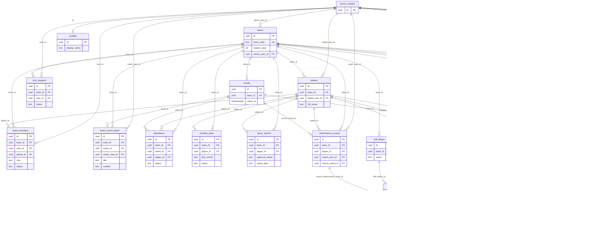
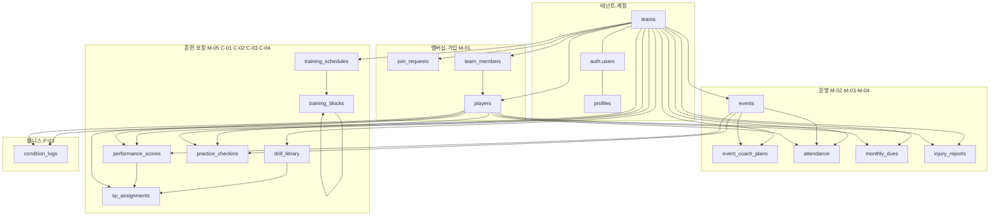

# PlayProve 데이터 ERD

**기준 소스:** `prisma/schema.prisma` + `prisma/migrations/*.sql` (실제 Postgres/Supabase DDL).  
삭제된 일괄 덤프 대신, 필요한 DDL 은 마이그레이션 폴더와 `database/training_event_coach_plans.sql` 등에 둡니다.  
`auth.users` 는 Supabase 인증(외부 스키마)입니다.

## 전체 관계 (Mermaid `erDiagram`)

> **참고:** `training_schedules` → `AUTH_USERS` 는 `coach_author_id`, `approved_by` 두 엣지로 표현했습니다. Mermaid는 동일 쌍에 라벨만 다르게 두 번 그릴 수 없어, 실제 DB는 컬럼명으로 구분됩니다.

### 공통 컬럼 (모든 `public.*` 테이블)

각 테이블에 실제로 존재: `created_at`, `updated_at`, `deleted_at`, `created_by`, `updated_by`, `metadata` (ERD 박스에는 생략).

## 영역별 묶음

## 영역 표

| 영역 | 테이블 |
|------|--------|
| 테넌트·계정 | `teams`, `profiles` + `auth.users` |
| 멤버십·가입 | `join_requests`, `team_members`, `players` |
| 운영 | `events`, `event_coach_plans`, `attendance`, `monthly_dues`, `injury_reports` |
| 훈련 | `training_schedules`, `training_blocks` |
| 코칭·자동화 | `drill_library`, `performance_scores`, `iip_assignments` |
| 즉시평가 | `practice_checkins` |
| 컨디션 | `condition_logs` |
